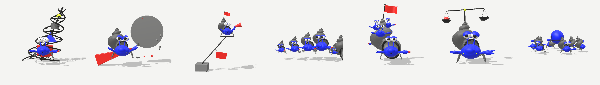

# Time Bank Spirit

**Live:** https://yunglong28.github.io/paguro-angelico/ (opens the studio)

A **character editor and generator** for the cast of Time Bank Spirit, a *banca del tempo* (a time bank,
where people exchange hours and services). The cast is spirits, Y2K blobs, chibi people, object-spirits,
uncanny beings and the original hermit crabs, each made a character by its body, its apparatus and what it
offers the time bank. Rendered live in 3D as 90s pre-rendered CGI, in four looks, exported as animated `.glb`.

**Two body plans.** `plan: "crab"` is the hermit crab (`engine/parts.js` `host`). `plan: "figure"` is the modular
body (`engine/figure.js`): body shape (egg, capsule, box, bell, drop, coin, hourglass, house), head (none, sphere,
egg, box, cat), face (round, button, void or visor eyes; mouth with fangs or none), ears/horns/antennae/fins,
arms (stub, noodle, long), legs (stub, legs, long, tentacles, wisp), an optional house on the back (shell, clock,
cottage, lantern) and a belly mark (clock, spiral, buttons, heart). Archetypes (Y2K blob, chibi, spirit, object
spirit, uncanny, hermit crab) are starting points; Randomize picks one and varies it.

One system: every character is a **genome** (a JSON file in `characters/`), and every tool reads and writes that
same genome through one schema (`engine/schema.js`).

```
            ┌─────────────── engine/schema.js: the genome (47+ typed genes, 21 parts) ───────────────┐
 Describe ──┤  Edit (inspector, outliner, click & drag)   Breed (evolution)   Blend (3 parents)      ├──► Save ──► characters/<series>/<id>.json
 (Claude)   └──────────────────────────────── studio/ ─────────────────────────────────────────────┘          npm run export / glb
```

## The studio (`/studio/`)
`npm run dev` → http://127.0.0.1:5173/studio/ (on the live site everything works except saving into the
project and Describe; there you download the JSON instead).

| Mode | What it does | Inspired by |
|---|---|---|
| **Edit** | Outliner on the left (identity, anatomy, palette, apparatus, brand), live model in the middle, inspector on the right with every gene: slider, exact value, **lock**, **dice**. Click a part on the model to select it; drag a selected apparatus part to move it. Add parts from the library, duplicate, remove. Undo/redo (⌘Z / ⇧⌘Z). | VRoid Studio's three-panel editor; Spore's part placement |
| **Breed** | The current character in the centre, eight children around it, chosen to be as different from each other as possible within the *spread*. Click one to adopt it and breed again. Locked genes never change. | Picbreeder; User-Controlled MAP-Elites (Sfikas et al. 2023); Design Galleries (Marks et al. 1997) |
| **Blend** | Three parents on a triangle; drag the point to mix. Numbers mix by weight, colours mix in OKLab, the apparatus comes from the strongest parent. *Keep* makes it a new character. | MetaHuman Creator's blend circle |
| **Describe** | Write a character in words; Claude writes the genome under the schema (clamped by `validate`). *Create new* or *Change current*. | 3D-GPT, ShapeCraft, Procedura: LLMs writing editable, part-structured programs |
| **Sheet** | Turnaround (front, ¾, side, back) and the six expressions. | Model sheets |
| **Lineage** | The family tree: every saved child keeps its `parent`. | |

**Interface.** Top bar: the character, the six workspaces (keys 1–6), undo/redo, Randomize, Save (split menu:
draft, publish to a series, JSON, .glb). Left rail: **Cast** (thumbnails, search, series filters, New from any
archetype), **Layers** (the character's structure), **Brand**. Right: the **inspector**, generated from the schema;
each row shows a dot when it differs from the default, resets on double-click, and has reset, randomize and lock on
hover. The viewport has a floating toolbar (looks, camera views, play, frame). Press <kbd>?</kbd> for every shortcut.
Under 1040 px the panels become drawers; on a phone the rail moves to the bottom.

**Looks** (same model, any palette): *Studio* (physical materials, paper backdrop), *Y2K* (glossier, box-art sky),
*Toon* (cel-shaded), *Print* (halftone toner/blu with fluo/rosso spot inks; each palette role says which press ink it prints with).

**Colour is free.** A palette is six roles (primary, shell/metal, line, accent, secondary, light), each a colour,
a finish (matte, plastic, candy, chrome, metal, gel, iridescent, pearl) and a print ink. Parts paint with
roles, never with colours, so one palette restyles a whole character. The studio generates harmonies in
OKLCH (analogous, complementary, split, triadic, tetradic, monochrome × candy, pastel, neon, earth, noir), and
the brand library (`brand/brand.json`) holds named palettes and the stage of each look.

## Run

```bash
npm run dev                          # the studio, with saving into characters/ and the Describe endpoint
npm run generate -- "a sleepy chrome bishop crab with a tower for a shell"   # text → characters/drafts/<id>.json
npm run new -- --from serafino --seed 302          # a mutated child, next to its parent
npm run manifest                     # rebuild characters/index.json
npm run export                       # every character: plate.png + sheet.png (headless Chrome) → output/renders/
npm run export -- serafino --loop    # + 4 s turntable loop.mp4 (ffmpeg)
npm run glb                          # output/models/<id>.glb with the idle animation baked in (no browser)
node scripts/shot.mjs output/renders/x.png "c=torre&look=y2k" "c=torre&look=print"   # any studio state to PNG
node scripts/turn.mjs characters/drafts/x.json output/renders/x-turn.png             # 4-angle strip of a draft
```

Renders wait for the studio to report that it has drawn (`window.tbs.frames`), never for a fixed time, so slow
software-rendered frames don't come out blank. Everything runs on Node built-ins (Node 22+) plus a local Chrome (and ffmpeg for loops); three.js is vendored.
The only dependency is optional: `npm install` adds the Anthropic SDK for **Describe** / `npm run generate`,
which also need credentials (`ANTHROPIC_API_KEY`, or `ant auth login`). The model is `claude-opus-5-5`.

## Folders
```
time-bank-spirit/
├── index.html        GitHub Pages entry, redirects to studio/
├── studio/           the app: editor + generators
│   ├── app.js        wiring: events, keyboard, render loop
│   ├── core/         store.js (cast, history, events) · viewport.js (3D, picking, overlays) · thumbs.js (previews)
│   ├── ui/           topbar · left (Cast / Layers / Brand) · inspector · generators · dom (icons, menus, toasts)
│   └── studio.css    the design system (tokens, components, responsive)
├── engine/           genome → rigged 3D character; runs in the browser and in Node
├── characters/       the genomes
│   ├── angeli/  collettivo/  banca/   one JSON per character, by series
│   ├── drafts/       saved from the studio or `npm run generate`, not in the cast yet
│   ├── index.json    generated by `npm run manifest` ("<series>/<id>")
│   └── lineage.json  the chat's earlier artifacts, which the first characters descend from
├── brand/brand.json  palette library + stage settings shared by every character
├── briefs/           what each series is about, and the style rules (y2k-style.md)
│   └── references/   source material (PDFs, not in git)
├── scripts/          the npm commands, the dev server and its API, chrome.mjs (one headless Chrome per run)
├── vendor/           three.js
├── docs/images/      screenshots used in this README
└── output/           renders and .glb models (generated, not in git)
```

### Engine
| | |
|---|---|
| `engine/schema.js` | **the genome**: anatomy genes, the part library with every parameter, `genes`/`setGene`, `randomize`, `mutate`, `breed`, `blend`, `distance`, `validate`, `describeSchema` |
| `engine/palette.js` | roles, finishes, OKLab/OKLCH, harmonies, the classic palette |
| `engine/press.js` | `ink()` role tags, palette materials, the four looks, the halftone press, the stage |
| `engine/build.js` | genome → rigged character (`up(t)`, `setExpression`, `face()`), part placement, selection tags |
| `engine/figure.js` | the modular figure (spirits, blobs, chibi, object-spirits) and the time-bank parts (`prop`, `orbit`) |
| `engine/parts.js` | the host crab (sculpted SDF anatomy, rigged eyes, expressions) and the Angeli parts |
| `engine/collettivo.js` | the Collettivo parts (some spawn extra crabs) |
| `engine/sdf.js` | SDF primitives, smooth blend, surface-nets mesher, geometry cache |
| `engine/bake.js` | procedural motion → glTF animation clip |
| `engine/rng.js` | seeded RNG |

### Adding to the system
- **A new part**: write `(params, ctx) => { obj, up(t) }` in `engine/parts.js` (or `collettivo.js`), register it in
  `PARTS`, then describe its genes in `engine/schema.js` → `PARTS`. The inspector, library, randomize, breed,
  blend, validation and the Describe prompt all pick it up from there.
- **A new gene on the crab**: read it in `host()` and add it to `ANATOMY` in the schema.
- **A new finish or look**: `engine/press.js` (`finishMaterial`, `LOOKS`) and `FINISHES` in `engine/palette.js`.

## The cast
- **Angeli**: Serafino, Ofanino, Doppia chela, Mandorla, Mandragora, Re Pescatore, Angelo di mare, Reliquiario. Brief: [`briefs/angeli.md`](briefs/angeli.md).
- **Collettivo** (justice, solidarity, the commons, Soviet constructivism): Torre, Cuneo rosso, Tribuna, Catena di vacanza, Casa comune, Bilancia, Internazionale. Brief: [`briefs/collettivo.md`](briefs/collettivo.md).
- **Banca del tempo**: Clessidra, Ora d'aria, Rammendo, Custode delle ore, Mutuo, Casa del tempo, Mestolo, Fantasma della biblioteca. Each one offers something (an hour of gardening, mending, cooking, reading aloud) and carries it as a held item.
- Style: [`briefs/y2k-style.md`](briefs/y2k-style.md), distilled from the *90s CG mascots/avatars* board.



## How the 3D is made
- **Sculpted, not stacked.** Bodies, claws, legs and eye stalks are signed-distance fields blended with smooth unions and polygonised with surface nets into single watertight meshes (`engine/sdf.js`).
- **Rigged.** Every moving part is its own node (stalks, eyelids, claw fingers, legs, wings, rings), driven by `up(t)`; `engine/bake.js` samples that motion into glTF keyframe tracks.
- **One model, every look.** Materials are swapped, never the model: the same object is printed, lit, cel-shaded or pre-rendered.
