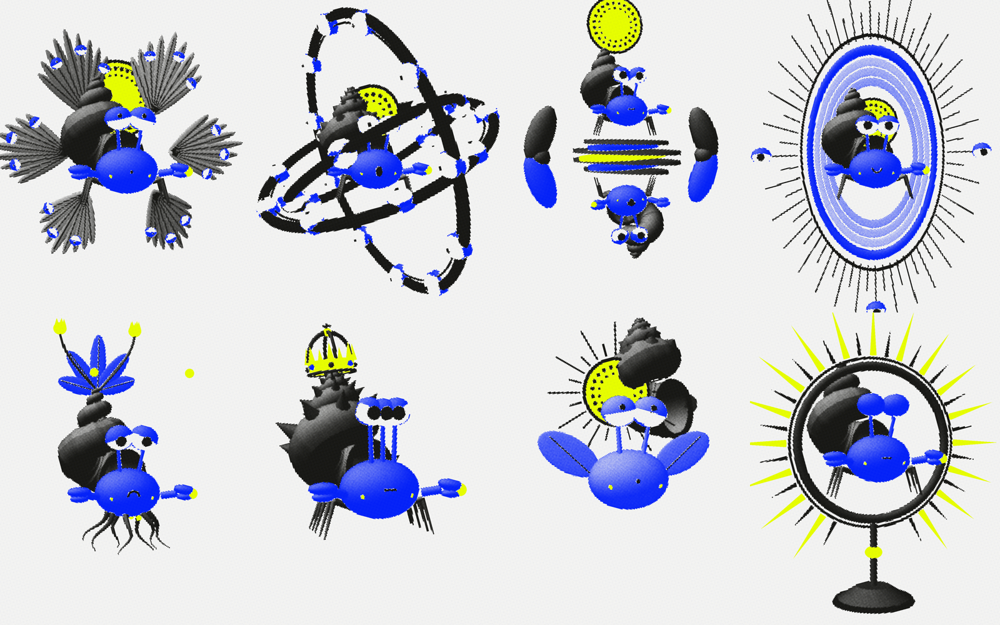
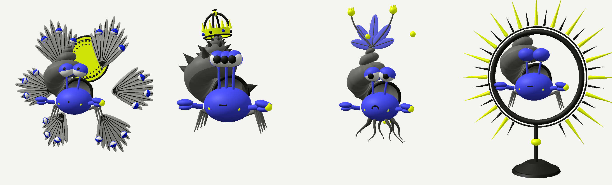

# paguro-angelico

Character pipeline for the **Spring Draw** mascot: a hermit crab as a medieval angel, rendered in
3D and printed in toner / blu / fluo halftone. Characters are **JSON specs** composed from a part
library, so new ones can be written, mutated, previewed and exported without touching the renderer.

```
brief ──► spec ──► mutate ──► view ──► export
briefs/   characters/  npm run new   viewer/    npm run export → out/<id>/{plate,sheet}.png
                                                npm run glb    → models/<id>.glb
```

**Live:** https://yunglong28.github.io/paguro-angelico/ (drag to rotate; *Stampa* / *3D* switches between the halftone print and the lit 3D model; *Scarica .glb* downloads the model)

| Stampa (print) | 3D |
|---|---|
|  |  |

3D models of every character are in [`models/`](models/) as `.glb` (open in Blender, or drag into https://gltf-viewer.donmccurdy.com).

## Run

```bash
npm run dev                         # http://127.0.0.1:5173/viewer/
npm run export                      # every character: plate.png + sheet.png  (headless Chrome)
npm run export -- serafino --loop   # + 4 s turntable loop.mp4 (ffmpeg)
npm run export -- --variants        # + 3×3 variant grid
npm run export -- --plate           # plates only, fast
npm run glb                         # models/<id>.glb, real 3D files (no browser needed)
node pipeline/turn.mjs drafts/x.json out/x-turn.png   # 4-angle strip of a draft spec
```

No npm install is needed. three.js is vendored and the scripts only use Node built-ins plus local Chrome and ffmpeg.

## Viewer modes
- **Tavola**: the plate. Drag to rotate.
- **Foglio**: model sheet. Turnaround (front, ¾, side, back), plus the six expressions.
- **Varianti**: 3×3 seeded mutations around the original (centre). Click one to get the
  `npm run new` command that promotes it.
- **Genealogia**: lineage graph, from the chat's first plate to every promoted variant.

## Making a character
1. **Brief**: add to or extend `briefs/` (concept, references, rules).
2. **Spec**: write `drafts/<id>.json`. Preview with `/viewer/?spec=drafts/<id>.json`.
3. **Mutate**: `npm run new -- --from <id> --seed <n> [--name "…"] [--id new-id]`.
   This writes `characters/<id>-s<n>.json` with `parent` set, so it shows up in Genealogia.
4. **Export**: `npm run export -- <id> --loop`.

### Spec shape
```jsonc
{
  "id": "serafino", "name": "Serafino", "parent": "paguro-angelico-v1",
  "concept": "…", "refs": ["Isaiah 6:2"], "seed": 3,
  "expression": "estasi",               // quiete | estasi | stupore | ira | pieta | sonno
  "pose": { "float": 0.12, "sway": 0.2, "scale": 0.92, "lift": 0 },
  "host": {                             // the hermit crab
    "scale": 0.72,
    "shell": { "turns": 4.5, "growth": 0.1, "knobs": 0, "ribs": 0.4, "tilt": -0.38, "detached": null },
    "body": { "ink": "blu" }, "eyes": { "stalk": 0.55, "count": 2 },
    "claws": { "hold": "seed" }, "legs": 3
  },
  "parts": [ { "type": "halo", "r": 0.62 }, { "type": "wings", "pairs": 3, "eyes": 3 } ]
}
```

**Parts** (`src/parts.js`): `halo` · `wings` · `rings` (ophanim) · `mandorla` · `eyecloud` ·
`double` (the Deleuze lobster) · `crown` · `mandrake` · `roots` · `parapodia` · `monstrance` ·
`plinth` · `seeds`. To add a part, write `(params, ctx) => { obj, up(t) }`, register it in
`PARTS`, and give its numeric params ranges in `src/mutate.js` so variants can explore them.

## Files
| | |
|---|---|
| `src/press.js` | render → separation buffer (R toner, G fluo, B blu) → halftone press pass |
| `src/parts.js` | host crab with rigged eyes, expressions, all parts |
| `src/build.js` | spec → rigged character (`up(t)`, `setExpression`, `face()`) |
| `src/mutate.js` | seeded RNG, param ranges, grafts, `mutate(spec, seed)`. Pure JS, shared with Node |
| `viewer/` | the app |
| `pipeline/` | `serve`, `manifest`, `new`, `export`, `turn` |
| `lineage.json` | the chat's earlier artifacts, which the characters descend from |
